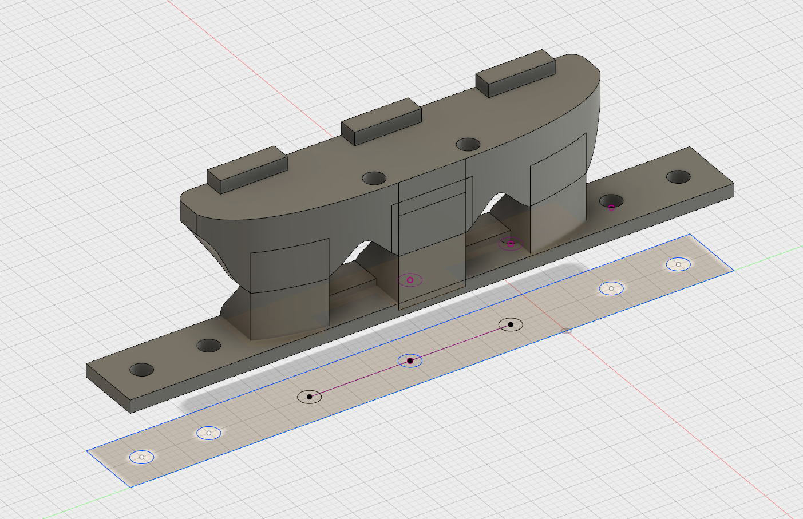
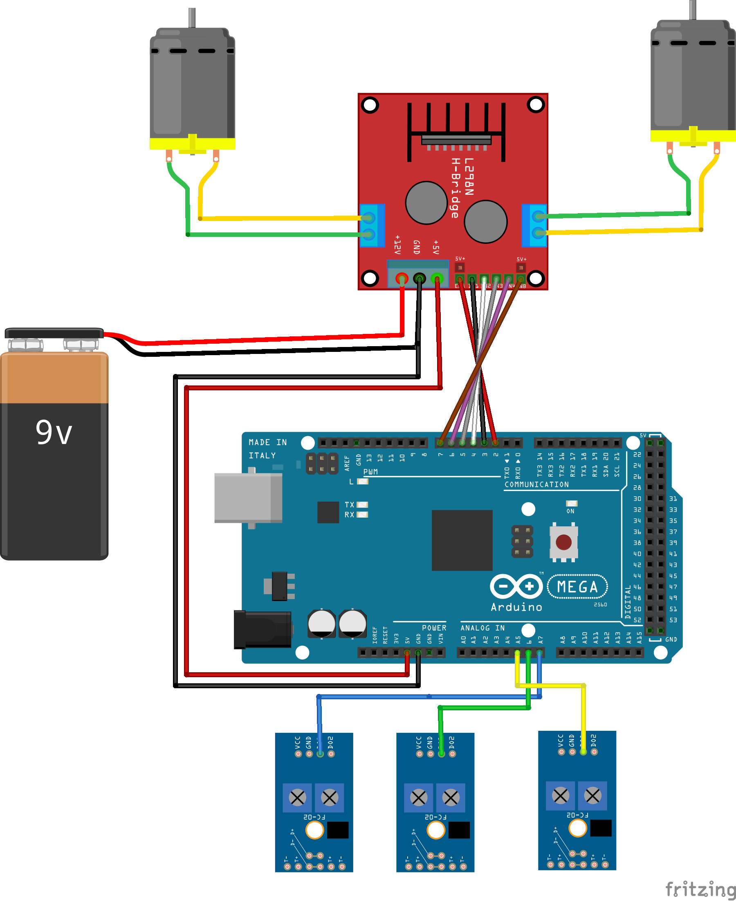
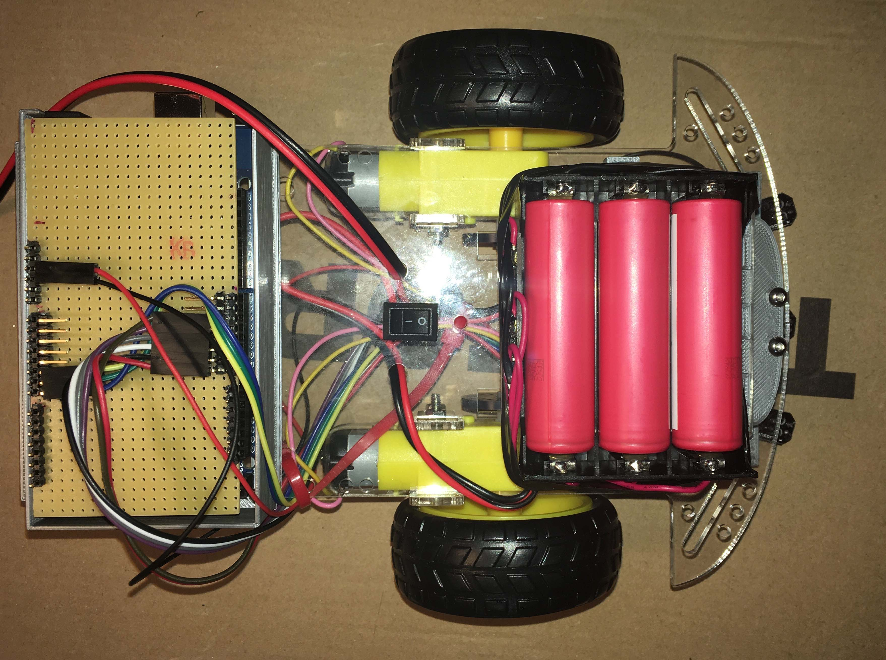

# Robot Platform

The Robot platform is using the Arduino Mega 2560 controller board and a standard cheap eBay 2WD line following robot platform.

## Hardware

* High Quality Plastic Battery Holder Storage Box Case for 18650 With Wire Lead 8 kr

* L298N Dual H Bridge DC Stepper Motor Drive Controller Board Module For Arduino - 21 kr

* New Smart Motor Robot Car Battery Box Chassis Kit Speed Encoder For Arduino 52 kr

* 3 Series BMS PCB Placa de Protección para Batería de Litio 18650 33 kr 

* 3 Panasonic NCR18650GA 3,6V / 3450mAh - Max 10A 150 kr

* (potional) 5PCS Slot Type IR Optocoupler Speed Sensor Module LM393 for Arduino 14 kr

* 5PCS IR Infrared Line Track Follower Sensor TCRT5000 Obstacle Avoidanc 12 kr

* (optional) 2PCS Obstacle Avoidance TCRT5000 Infrared Track Sensor Module For Arduino 7 kr

* 3d printed parts

* cables

### Sensor Front Mount

The mount should be 20 mm high i.e. the distance from under the robot frame to where the sensors are screwed into the mount.

[Sensor Mount STL](LF_sensor_holder.stl)

## Controller wiring

## Assembled robot 

